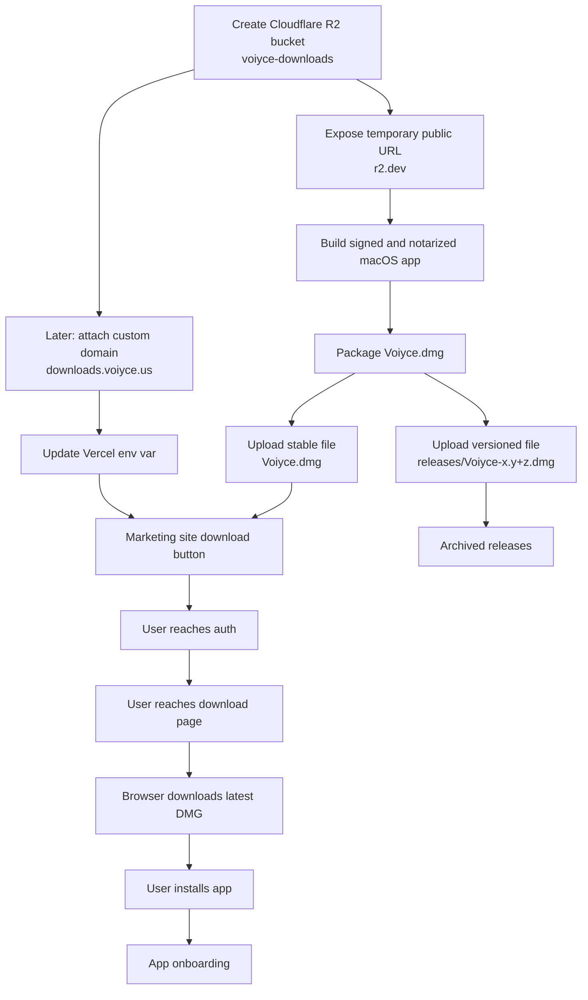
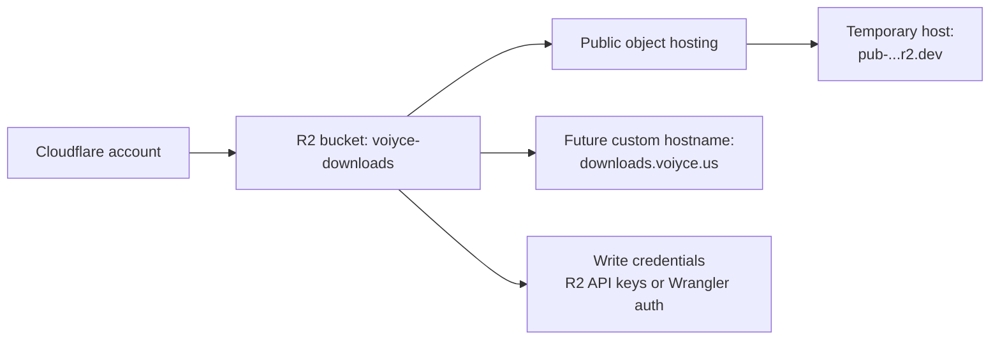
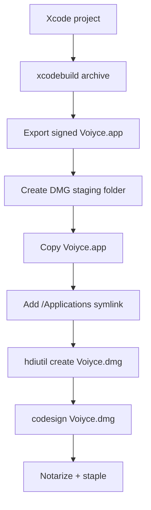
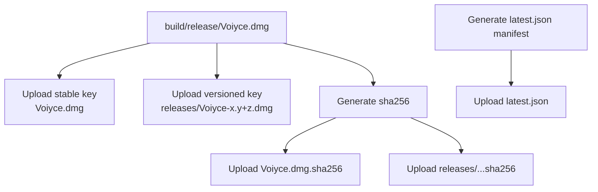
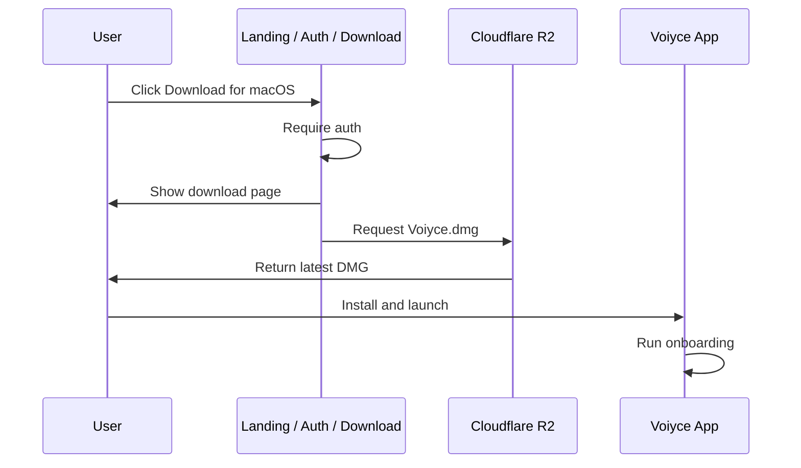
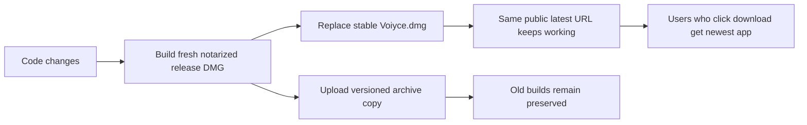
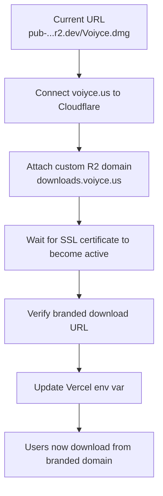

# Voiyce Release And Download Flow

This document shows the full path from creating the Cloudflare R2 bucket to shipping a new macOS `.dmg`, serving it to users, and later moving from the temporary `r2.dev` URL to the official branded domain.

Current live temporary download URL:

```text
https://pub-4e78e629768e4c8fa39fdab493de9a41.r2.dev/Voiyce.dmg
```

Target branded download hostname:

```text
https://downloads.voiyce.us/Voiyce.dmg
```

## 1. End-To-End Visual



## 2. One-Time Infrastructure Setup



### Bucket setup

1. Open Cloudflare `R2 Object Storage`.
2. Create bucket `voiyce-downloads`.
3. Use the temporary `r2.dev` public URL until the branded domain is connected.

### Access setup

You have two valid upload paths:

- Scripted S3-compatible upload using:
  - `CF_R2_ACCOUNT_ID`
  - `CF_R2_BUCKET`
  - `CF_R2_ACCESS_KEY_ID`
  - `CF_R2_SECRET_ACCESS_KEY`
- Wrangler-authenticated upload using:
  - `npx wrangler r2 object put ... --remote`

## 3. Packaging The macOS Release

Release script:

[`scripts/release-macos-dmg.sh`](/Users/sirakinb/Desktop/Voiyce-Agent/scripts/release-macos-dmg.sh)

Output artifacts:

- `build/release/export/Voiyce.app`
- `build/release/Voiyce.dmg`
- `build/release/Voiyce-Agent.xcarchive`

### Packaging visual



### Command

```bash
export DEVELOPER_IDENTITY="Developer ID Application: Your Company Name (R28KUQ4KQP)"
./scripts/release-macos-dmg.sh --clean --notary-profile "<your-profile>"
```

Providing `DEVELOPER_IDENTITY` avoids the script's fallback keychain scan, which can trigger unrelated macOS permission prompts from the `security` CLI.

Local-only non-distributable build:

```bash
./scripts/release-macos-dmg.sh --clean --skip-notarize
```

## 4. Upload Layout In R2

Stable latest objects:

- `Voiyce.dmg`
- `Voiyce.dmg.sha256`
- `latest.json`

Versioned archive objects:

- `releases/Voiyce-1.0+1.dmg`
- `releases/Voiyce-1.0+1.dmg.sha256`

### Storage visual



## 5. How Downloads Work Today



Right now the site should point at:

```bash
NEXT_PUBLIC_DOWNLOAD_URL=https://pub-4e78e629768e4c8fa39fdab493de9a41.r2.dev/Voiyce.dmg
```

Relevant site config:

- [`landing-page/src/lib/voiyce-config.ts`](/Users/sirakinb/Desktop/Voiyce-Agent/landing-page/src/lib/voiyce-config.ts)
- [`src/app/page.tsx`](/Users/sirakinb/Desktop/Voiyce-Agent/src/app/page.tsx)

## 6. Updating For Each New Build

When a new release is ready, the process is:



### Practical rule

- Keep the stable key the same: `Voiyce.dmg`
- Always overwrite it with the newest release
- Also upload a versioned copy for rollback and auditability

That means the public latest link does not change every release.

### Scripted publish path

[`scripts/publish-dmg-to-r2.sh`](/Users/sirakinb/Desktop/Voiyce-Agent/scripts/publish-dmg-to-r2.sh)

The publish script now refuses to upload a DMG unless both of these pass locally:

- `xcrun stapler validate build/release/Voiyce.dmg`
- `spctl -a -t open --context context:primary-signature -vv build/release/Voiyce.dmg`

Environment shape:

```bash
export CF_R2_ACCOUNT_ID="..."
export CF_R2_BUCKET="voiyce-downloads"
export CF_R2_ACCESS_KEY_ID="..."
export CF_R2_SECRET_ACCESS_KEY="..."
export R2_PUBLIC_BASE_URL="https://downloads.voiyce.us"
./scripts/publish-dmg-to-r2.sh
```

### Wrangler publish path

Useful when Wrangler auth is already set up:

```bash
npx wrangler r2 object put voiyce-downloads/Voiyce.dmg --remote --file build/release/Voiyce.dmg
```

## 7. Connecting The Official Domain

Current temporary state:

- Download file is public at `r2.dev`
- Site should use the `r2.dev` URL

Future branded state:

- Create or attach `voiyce.us` in Cloudflare
- Add R2 custom domain `downloads.voiyce.us`
- Wait for SSL issuance
- Point the site env var to the branded hostname

### Domain cutover visual



### Target Vercel env var after cutover

```bash
NEXT_PUBLIC_DOWNLOAD_URL=https://downloads.voiyce.us/Voiyce.dmg
```

## 8. Verification Checklist

Before every upload:

```bash
xcrun stapler validate build/release/Voiyce.dmg
spctl -a -t open --context context:primary-signature -vv build/release/Voiyce.dmg
```

After every upload:

```bash
curl -I https://pub-4e78e629768e4c8fa39fdab493de9a41.r2.dev/Voiyce.dmg
curl https://pub-4e78e629768e4c8fa39fdab493de9a41.r2.dev/Voiyce.dmg.sha256
curl https://pub-4e78e629768e4c8fa39fdab493de9a41.r2.dev/latest.json
```

After domain cutover:

```bash
curl -I https://downloads.voiyce.us/Voiyce.dmg
curl https://downloads.voiyce.us/Voiyce.dmg.sha256
curl https://downloads.voiyce.us/latest.json
```

Confirm all of the following:

- `Voiyce.dmg` returns `200 OK`
- `Last-Modified` reflects the latest upload
- file size changed when expected
- `sha256` matches the local build output
- `latest.json` points at the right stable and versioned URLs
- the site env var matches the currently intended public hostname

## 9. Source Map

Primary files involved in this flow:

- [`docs/cloudflare-r2-release.md`](/Users/sirakinb/Desktop/Voiyce-Agent/docs/cloudflare-r2-release.md)
- [`scripts/release-macos-dmg.sh`](/Users/sirakinb/Desktop/Voiyce-Agent/scripts/release-macos-dmg.sh)
- [`scripts/publish-dmg-to-r2.sh`](/Users/sirakinb/Desktop/Voiyce-Agent/scripts/publish-dmg-to-r2.sh)
- [`landing-page/src/lib/voiyce-config.ts`](/Users/sirakinb/Desktop/Voiyce-Agent/landing-page/src/lib/voiyce-config.ts)
- [`src/app/page.tsx`](/Users/sirakinb/Desktop/Voiyce-Agent/src/app/page.tsx)

## 10. Recommended Operating Model

Use this default policy:

1. Build fresh notarized DMG.
2. Upload new DMG to the stable `Voiyce.dmg` key.
3. Upload the same build to a versioned `releases/...` key.
4. Verify `r2.dev` or branded domain publicly.
5. Keep the website pointed at the stable latest key.
6. Only change the public hostname when moving from `r2.dev` to `downloads.voiyce.us`.

That keeps the user-facing download link simple while still preserving historical release artifacts.
