# Website To Paywall User Flow For Stakeholders

This is the simplified product-facing version of the Voiyce funnel, without implementation detail.

```mermaid
flowchart LR
    A[User lands on website] --> B[Creates account]
    B --> C[Download page opens]
    C --> D[Mac app downloads]
    D --> E[User installs and opens app]
    E --> F[User signs in inside app]
    F --> G[User completes onboarding and permissions]
    G --> H[User starts free trial]
    H --> I[User dictates and sees value]
    I --> J{Trial still active?}
    J -->|Yes| I
    J -->|No| K[Paywall appears in app]
    K --> L[User chooses Monthly or Yearly]
    L --> M[Stripe Checkout opens in browser]
    M --> N{Payment succeeds?}
    N -->|No| K
    N -->|Yes| O[Subscription activates]
    O --> P[Unlimited dictation unlocked]
```

## Plain-English summary

- The website gets the user to create an account and start the Mac download.
- The app requires its own sign-in and onboarding before dictation is usable.
- Every new user starts with a free trial.
- The user experiences the product first, then hits the paywall only after the trial runs out.
- When the paywall appears, payment happens through Stripe in the browser.
- After successful checkout, the app refreshes access and unlocks the paid plan.

## Trial and paywall rules today

- Trial length: 7 days
- Trial usage cap: 2,500 words
- Paywall trigger: whichever happens first
- Plans shown after trial: Monthly or Yearly

## Stripe status today

- Stripe is wired in test mode on the linked backend environment.
- The deployed secret key is using the `sk_test...` format.
- The webhook secret is present.
- A Stripe price ID is configured for checkout.
