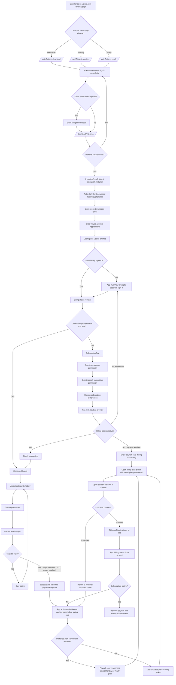

# Website To Paywall User Flow

This visual maps the current Voiyce journey from website landing through account creation, Mac download, in-app onboarding, trial usage, and the paywall trigger.

## What this diagram reflects

- The website auth session and the app auth session are separate. The user must sign in again inside the Mac app.
- The website can capture plan intent (`monthly` or `yearly`) before download and save it for later checkout preselection.
- The app grants access during the trial with no card required up front.
- The paywall appears when the trial is exhausted by time or by word usage.
- The app sends the user to Stripe Checkout from the in-app billing picker and refreshes access after the callback returns.

## Source references

- Website intent, trial copy, and download URL: `/landing-page/src/lib/voiyce-config.ts`
- Website auth handoff: `/landing-page/src/components/AuthPageClient.tsx`
- Website download handoff: `/landing-page/src/components/DownloadPageClient.tsx`
- App auth/onboarding/dashboard routing: `/Voiyce-Agent/ContentView.swift`
- Paywall and trial logic: `/Voiyce-Agent/Services/Billing/BillingManager.swift`
- Onboarding gating: `/Voiyce-Agent/Features/Onboarding/OnboardingView.swift`
- Dashboard paywall surface: `/Voiyce-Agent/Features/Dashboard/DashboardView.swift`
- Word-usage trigger that flips access to payment required: `/Voiyce-Agent/Voiyce_AgentApp.swift`
